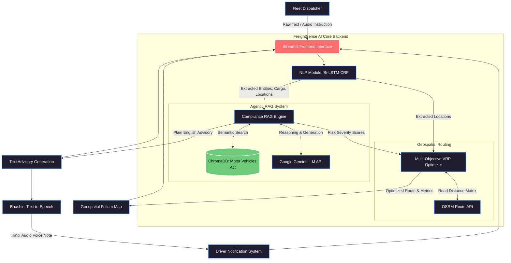
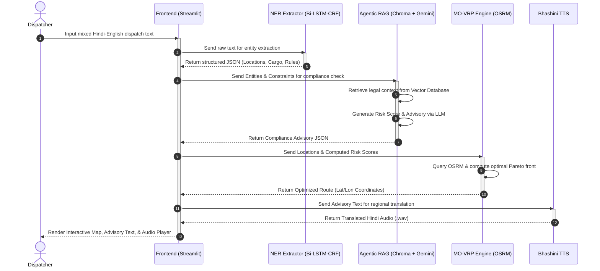

# FreightSense Architecture Diagrams

Here are the block diagrams that you can use to replace the placeholders in your IEEE LaTeX paper.

> [!TIP]
> You can take a screenshot of these diagrams directly from this interface, or copy the Mermaid code block below each image and paste it into [Mermaid Live Editor](https://mermaid.live/) to export them as high-quality PNG/SVG files for your paper.

---

### Figure 1: Block Diagram of FreightSense Architecture

---

### Figure 2: Step-by-Step Pipeline Execution Flow

